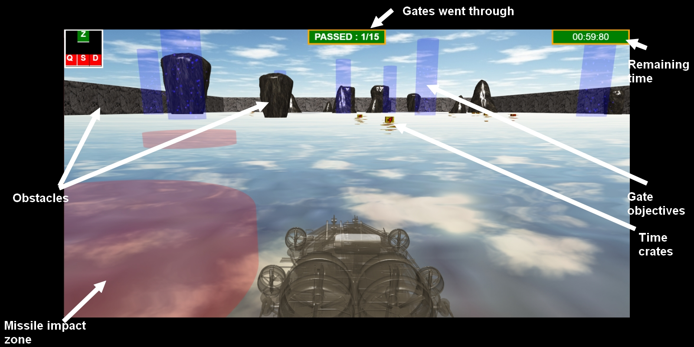

# SeaScape 

## How to play ?

The goal is to pass through all the **gates** within the limited time. The gates are the moving, tall blue lights.

There are 15 to go through within 69 seconds.

Avoid **sea stacks** and other obstacles as they'll crash your boat and slow you down!

Avoid the **missiles** as they'll reduce your time!

Collect the **time crates** to freeze the time for a few seconds! They exist as 1, 2 or 3 seconds freezing, the longer one being more rare.

### In-game

### Keys

<kbd>Z</kbd> : move forward

<kbd>S</kbd> : move backward

<kbd>Q</kbd> : turn left

<kbd>D</kbd> : turn right

## Bugs

Take a decent distance with the sea stacks. They use an unrealistic, bigger hitbox than what they're represented as. Until we find out how to make complex bounding boxes, these obstacles will be very sticky, sorry about that. 

To restart the game, refresh it (F5). When getting a game over/winning screen, the prompted button to restart doesn't work correctly.

The map is generated randomly, so if by any chance you happen to start the game stuck in a sea stack, refresh it lol

Taking a gate before the SFX from the previous one ended will loop the sound D:

## Credits

Thanks to the work of the following artists/rippers for some of the game's resource :

TheLegendOfRenegade (Youtube) - Game BGM

Friedslick6 (Textures-resource.com) - Crash Bandicoot crate textures

Random Talking Bush (sounds-resource.com) - Crash Bandicoot sound effects

3dtextures.me - boat wood texture

Need to find the sources for the random sound effects
